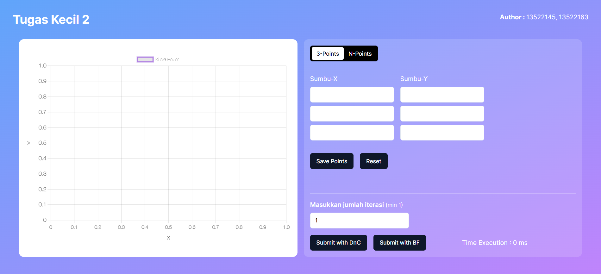

# Tugas Kecil 2 IF2211 Strategi Algoritma
> Live Website Tucil
> Live demo [_here_](https://tucil2-13522145-13522163-t4uo.vercel.app/ ). <!-- If you have the project hosted somewhere, include the link here. -->

## Table of Contents
* [General Info](#general-information)
* [Technologies Used](#technologies-used)
* [Features](#features)
* [Screenshots](#screenshots)
* [Setup](#setup)
* [Usage](#usage)
* [Project Status](#project-status)
* [Room for Improvement](#room-for-improvement)
* [Acknowledgements](#acknowledgements)
* [Contact](#contact)
<!-- * [License](#license) -->

## General Information
- Provide general information about your project here.
- What problem does it (intend to) solve?
- What is the purpose of your project?
- Why did you undertake it?
<!-- You don't have to answer all the questions - just the ones relevant to your project. -->

## Technologies Used
- Next JS 14.1.3
- Tailwind CSS 3.30
- Shadcn UI
- Chart JS 4.4.2

## Features
- Create bezier curve with divide and conquer algorithm
- Create bezier curve with brufe force algorithm
- N points input for both algorithm

## Screenshots

<!-- If you have screenshots you'd like to share, include them here. -->

## Setup
What are the project requirements/dependencies? Where are they listed? A requirements.txt or a Pipfile.lock file perhaps? Where is it located?

Proceed to describe how to install / setup one's local environment / get started with the project.

## Usage
1. Clone the repository
`git clone https://github.com/AtqiyaHaydar/Tucil2_13522145_13522163.git`

2. Change directory to ./src/
`cd ./src/`

3. Install node package manager (this includes installing all dependencies)
`npm install`

4. Run the project
`npm run dev`

5. Visit http://localhost:3000/ in your browser

## Project Status
Project is: _complete_

## Room for Improvement
Room for improvement:
- The program must be able to process more quickly than 10 iterations

To do:
- Optimizing the front end of the program to produce graphics faster

## Acknowledgements
Give credit here.
- This project was inspired by...
- This project was based on [this tutorial](https://www.example.com).
- Many thanks to...

## Contact
Created by [@flynerdpl](https://www.flynerd.pl/) - feel free to contact me!

<!-- Optional -->
<!-- ## License -->
<!-- This project is open source and available under the [... License](). -->

<!-- You don't have to include all sections - just the one's relevant to your project -->
